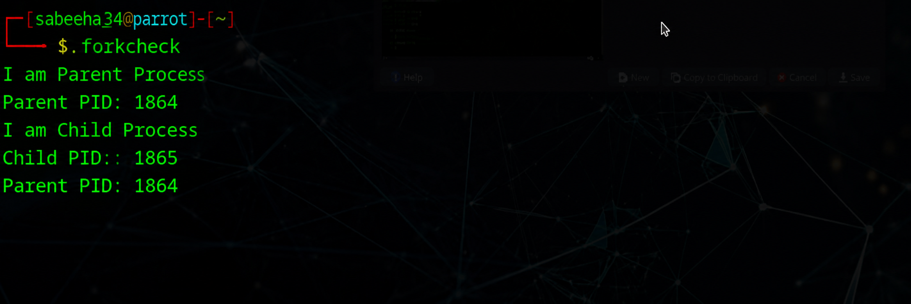

# Linux-Process-API-fork-wait-exec-
Ex02-Linux Process API-fork(), wait(), exec()
# Ex02-OS-Linux-Process API - fork(), wait(), exec()
Operating systems Lab exercise


# AIM:
To write C Program that uses Linux Process API - fork(), wait(), exec()

# DESIGN STEPS:

### Step 1:

Navigate to any Linux environment installed on the system or installed inside a virtual environment like virtual box/vmware or online linux JSLinux (https://bellard.org/jslinux/vm.html?url=alpine-x86.cfg&mem=192) or docker.

### Step 2:

Write the C Program using Linux Process API - fork(), wait(), exec()

### Step 3:

Test the C Program for the desired output. 

# PROGRAM:

## C Program to create new process using Linux API system calls fork() and getpid() , getppid() and to print process ID and parent Process ID using Linux API system calls
```
#include <stdio.h>
#include <stdlib.h>
#include <unistd.h>
#include <sys/wait.h>

int main()
{
    int pid = fork();

    if(pid == 0)
    {
        printf("I am Child Process\n");
        printf("Child PID : %d\n", getpid());
        printf("Parent PID: %d\n", getppid());

        sleep(2);
    }
    else
    {
        printf("I am Parent Process\n");
        printf("Parent PID: %d\n", getpid());

        wait(NULL);
    }

    return 0;
}
```
##OUTPUT



## C Program to execute Linux system commands using Linux API system calls exec() , exit() , wait() family
```
#include <stdio.h>
#include <stdlib.h>
#include <unistd.h>
#include <sys/types.h>
#include <sys/wait.h>

int main()
{
    int status;

    printf("Running ps with execl\n");

    if(fork() == 0)
    {
        execl("/bin/ps", "ps", "-f", NULL);

        perror("execl failed");
        exit(1);
    }

    wait(&status);

    if(WIFEXITED(status))
    {
        printf("Child exited with status: %d\n",
               WEXITSTATUS(status));
    }

    printf("\nRunning ps with execlp\n");

    if(fork() == 0)
    {
        execlp("ps", "ps", "-f", NULL);

        perror("execlp failed");
        exit(1);
    }

    wait(&status);

    if(WIFEXITED(status))
    {
        printf("Child exited with status: %d\n",
               WEXITSTATUS(status));
    }

    printf("Done\n");

    return 0;
}
```
##OUTPUT


# RESULT:
The programs are executed successfully.
